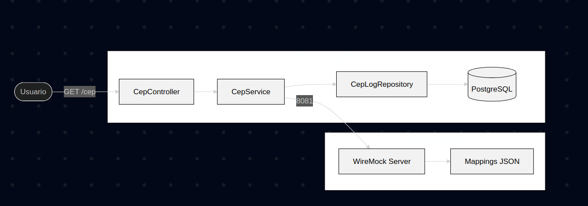

# CEP API - Consulta e Registro de Logs

Esta aplicação é uma API desenvolvida em Spring Boot para consulta de endereços via CEP, com simulação de infraestrutura completa utilizando containers para banco de dados e servidores de mock.

## 1. Desenho da Solucao



## 2. Requisitos Atendidos

1. **Desenho de Solucao**: Imagem inclusa detalhando a arquitetura e o fluxo de dados.
2. **API Externa Mocada**: Utilizacao de WireMock rodando em container independente (porta 8081).
3. **Registro de Logs**: Persistencia em banco de dados PostgreSQL com registro de timestamp, CEP consultado e resposta completa (JSON) da API.
4. **SOLID**: Aplicacao dos principios de responsabilidade unica (SRP) e injecao de dependencia.

## 3. Diferenciais Implementados

* **Conteinerizacao**: Utilizacao de Podman/Docker para orquestrar o banco de dados e o servidor de mocks via `docker-compose`.
* **Banco de Dados Real**: Utilizacao do PostgreSQL 15, garantindo persistência real dos dados fora da memória da aplicação.
* **Resiliencia**: Tratamento de exceções (404 Not Found) para garantir que mesmo consultas sem sucesso sejam registradas no banco para auditoria.

## 4. Como Executar

### Pre-requisitos
* Java 17 ou superior
* Maven 3.8+
* Podman (ou Docker) com Podman-compose instalado

### Passo 1: Iniciar a Infraestrutura (Banco e Mock)
Na pasta raiz do projeto, execute o comando:
```bash
podman-compose up -d
```

### Passo 2: Iniciar a Aplicacao
```bash
mvn spring-boot:run
```

## 5. Endpoints Disponiveis

* **Consultar CEP**: `GET http://localhost:8080/cep?cep=01001-000`
* **Listar todos os Logs**: `GET http://localhost:8080/cep/logs`

## 6. Configuracao do Banco (Docker/Podman)
* **Host**: localhost
* **Porta**: 5432
* **Database**: cepdb
* **Username**: user
* **Password**: password
